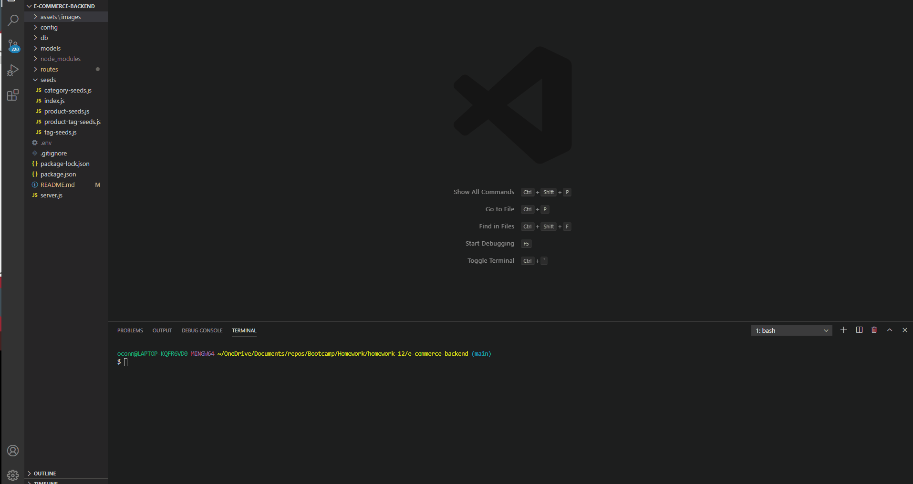

# -e-commerce-backend

## Table of Contents
    * [Description](#Description)
    * [Technologies](#Technologies)
    * [License](#License)
    * [Installation](#Installation)
    * [Usage](#Usage)
    * [Contributions](#Contributions)
    * [Support](#Support)
  
  
## Description 
    * This assignment is for the back end of an e-commerce website. I have used starter code to configure a working Express.js API to use Sequelize to interact with a MySQL database.
  
  
  
## License 
  * MIT, to view License information click the badge below!
  * 

  
## Technologies 
  
    * JavaScript
    * NodeJs
    * Markdown
    * Express Js
    * NodeJs
    * Sequelize
    * MySQL
    * Nodemon
  
 

## Installation 
  
    * To install the dependencies run 'npm i' in the command line.
    * To start the server enter 'npm start' to the command line, or run 'npm run watch' to begin nodemon

    
  
## Usage
    Run npm i to install all the needed depenencies and then use the command line to start the app with npm run start. Then you can use localhost:3001 or an editor such as insomnia to see the functionality.
  
  
## Contributions 
    Author: Michael O'Connor https://github.com/oconnor97
  
  
## Support
  
  If you have any questions contact Michael O'Connor, at moconnor0813@gmail.com or on github at https://github.com/oconnor97
  
  
  

